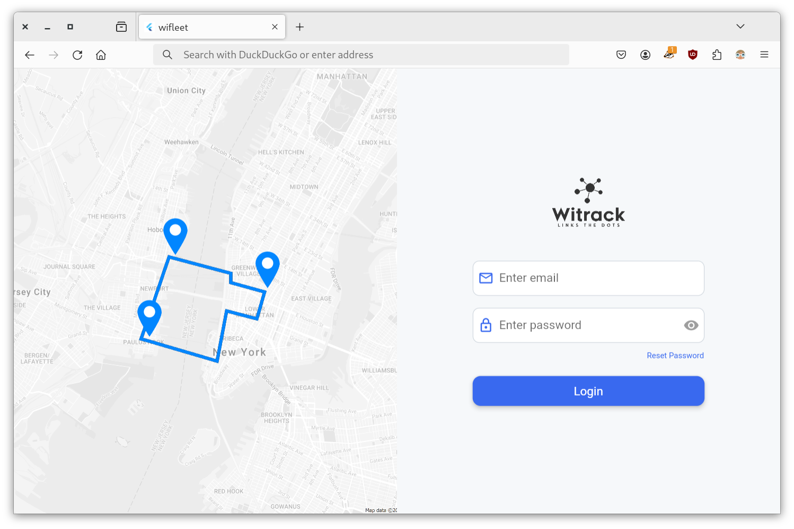
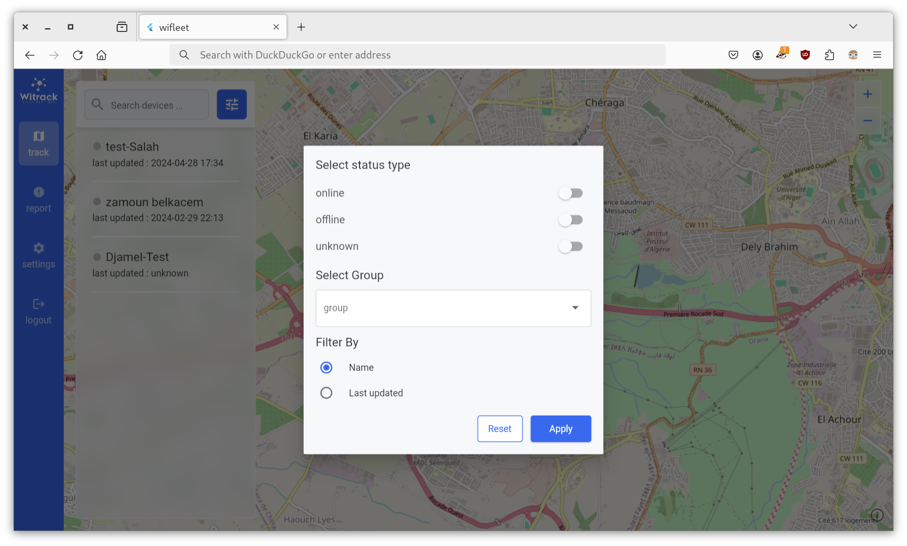

# new wifleet

web app to manage GPS tracking devices .

## Key Features
- **Management**: Create, delete, and edit devices, users, groups, drivers, and geofences.
- **Linking**: Associate devices with users, groups, drivers, and geofences.
- **Real-time Tracking**: Monitor devices on an interactive map.
- **Status Monitoring**: Check device connectivity and status.
- **Historical Position Replay**: Replay device positions for selected timestamps.
- **Reporting**: Generate reports for detailed analysis.

## Used packages

- go_router
- lottie
- flutter_animate
- dio
- shared_preferences
- provider
- flutter_map
- latlong2
- flutter_map_cancellable_tile_provider
- url_launcher
- glass_kit
- loading_indicator
- excel
- side_sheet
- image_picker
- dropdown_button2
- flutter_map_line_editor
- flutter_map_dragmarker
- flutter_map_animations
